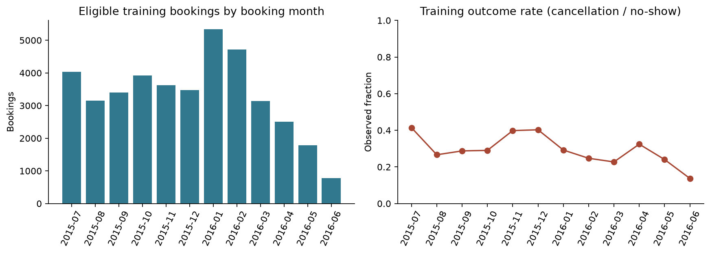
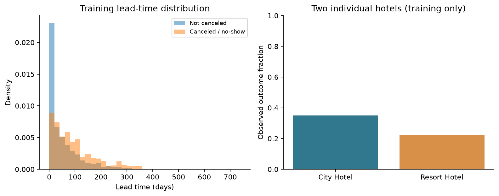

# Retrospective Ranking and Association Analysis of Hotel Booking Non-Completion

**IS507 Midterm report draft — analysis date 2026-09-29; course requirements checked 2026-09-30.** This working copy covers the student's complete end-to-end project: problem formulation, data audit, preprocessing, modeling, evaluation and interpretation. Every stage is within the student's responsibility and preparation scope. The supplied syllabus has been reviewed; the specific Midterm Assignment screenshot remains unavailable. No final holdout predictions were made.

### 1. Research Question & Revised Estimand

**Research Question:** Which observable booking characteristics are associated with hotel booking non-completion, and how well can they distinguish completed bookings from cancellations or no-shows in the eligible retrospective cohort?

**Outcome:** `is_canceled = 1` includes Canceled + No-Show; `is_canceled = 0` corresponds to recorded Check-Out. The unit is one booking, not one guest. This does not measure guest intent or an intervention effect.

**Revised estimand:** Retrospective discrimination, probability quality and predictive associations on the calendar- and maturity-selected sample. This is not strict booking-creation-time prediction: the released data do not preserve complete point-in-time feature snapshots. The horizon is the recorded terminal booking outcome, not a fixed number of days.

**Current recommendation: HOLD operational use; continue the educational retrospective analysis.** The primary logistic model achieved validation ROC-AUC 0.658 versus 0.500 for a constant-probability baseline. Yet the 0.5 decision threshold recovered only 11 of 3,689 positives. More fundamentally, the public dataset does not provide original creation-time snapshots. Prospective operational performance is outside the supported estimand. The executable benchmark concerns a restricted retrospective cohort and conditionally plausible predictors, not a certified reservation-time deployment.

### 2. Data Source & Generation

Antonio, de Almeida and Nunes (2019) describe anonymized records from two Portuguese hotel property-management systems (PMS): one resort in Algarve and one city hotel in Lisbon. The public data include bookings with scheduled arrivals from July 2015 through August 2017. TidyTuesday combines the two source tables and standardizes field names. We retrieved its CSV and verified 119,390 rows, 32 columns, hotel counts (40,060 resort; 79,330 city), and the published arrival-date range. The checksum and source URL are saved in `data/raw/PROVENANCE.json`. This verifies structural consistency, not byte identity with the publisher's supplementary ZIPs.

### 3. Outcome Definition

The development-only status/target cross-tab below verifies the combined endpoint. No final-holdout outcome cross-tab was produced. The source paper Tables 3 and 6 also distinguish cancellations from no-shows [1].

| partition   | reservation_status   |   is_canceled |     n |
|:------------|:---------------------|--------------:|------:|
| train       | Canceled             |             1 | 11671 |
| train       | Check-Out            |             0 | 27607 |
| train       | No-Show              |             1 |   587 |
| validation  | Canceled             |             1 |  3545 |
| validation  | Check-Out            |             0 | 10399 |
| validation  | No-Show              |             1 |   144 |

### 4. Target Population & Observed Sample

The source systems record bookings, amendments and eventual status; extraction uses booking tables and change logs, with many values taken relative to the day before arrival. The observed sample is thus selected through two hotels, their recording systems, and an arrival window. It is not a random sample of hotels or of all bookings created during these years. The target population for this revised analysis is the eligible observed booking cohort at these two hotels. Newly created bookings at the same hotels are a possible future operational population, not the population identified here. Even that extension needs caution because arrivals outside the source window are absent, especially long-lead bookings near the right boundary.

A second selection layer is our calendar and maturation eligibility rule. It favors bookings with recorded outcomes and planned departure before each analysis origin; it is **not** a representative sample of every booking created during the validation months. No inference to a national/global hotel population, causal effect, or effective independent sample size is justified. `hotel` identifies two establishments; a difference between them cannot establish an effect of hotel type.

### 5. Temporal Provenance & Leakage Audit

The central limitation is temporal measurement: a value that *could* exist at booking time is not proven to be the value that existed then. We exclude status/status date, assigned room, booking-change count, waiting days, transaction-derived ADR, deposit status, parking and accumulated special requests. Prior-outcome history and repeated-guest status are also omitted as predictors because history availability at creation is not independently verified. Country is excluded primarily because nationality may only be corrected at check-in [1]. The repeated-guest definition checks profile creation before booking creation [1]; exclusion is conservative, not proof of future information. Prior-booking outcome availability remains uncertain. See the [complete column audit](../tables/prediction_time_leakage_audit.csv). The pipeline enforces an explicit approved feature set, including for sensitivity models.

The primary feature list is: lead_time, stays_in_weekend_nights, stays_in_week_nights, adults, children, babies, arrival_month_sin, arrival_month_cos, hotel, meal, market_segment, distribution_channel, reserved_room_type. Hotel identity is stable; other inputs remain conditional on their recorded values matching initial booking information. Planned dates, length of stay, party composition, room, meal and channel may have changed. Removing the most obvious outcome proxies reduces risk but does not certify freedom from leakage. A smaller hotel/lead-time/seasonality sensitivity has the same remaining timestamp assumptions.

`booking_date = arrival_date - lead_time` is a **reconstructed proxy**, not an observed creation timestamp. We validate arithmetic and calendar boundaries; we cannot establish its original transactional provenance. Status date is used only to restrict administrative label availability, never as a predictor. All transformations that learn from data fit on training rows only.

### 6. Data Quality & Preprocessing

Raw bytes are preserved. Agent and company `NULL` values are structural non-applicability according to source documentation; they become a named category rather than an invented numeric zero. Country `NULL` becomes Unknown, while children `NA` becomes numeric missingness. Raw token counts are retained, so literal missing tokens are not confused with true zero children or numeric ID magnitudes. Agent, company and country are excluded from the primary model; children use training-median imputation inside the pipeline. We do not claim to identify MCAR, MAR or MNAR from this table, and single imputation does not propagate missing-data uncertainty.

| column   |   literal_NULL |   literal_NA |   empty |
|:---------|---------------:|-------------:|--------:|
| children |              0 |            4 |       0 |
| country  |            488 |            0 |       0 |
| agent    |          16340 |            0 |       0 |
| company  |         112593 |            0 |       0 |

Eligible training data contain 11,395 exact redundant rows; eligible validation contains 1,635. These are extra copies after the first occurrence within each partition. There is no booking identifier proving that identical records are erroneous: bookings for a group can legitimately coincide. The primary analysis retains rows. A sensitivity analysis deduplicates only the training table and evaluates on the same validation rows; a separate analysis evaluates the unchanged primary model on unique validation rows. Their different estimands must not be mixed. Exact full-row hashes do not cross the train/validation boundary (0 overlaps), but that does not rule out repeated guests or group dependence.

The development cohort contains 2,123 rows flagged as repeated guests. Guest and group IDs are unavailable, so entity-disjoint validation and person-level clustering cannot be established. `agent` and `company` are not guest IDs. We avoid ordinary independent-row confidence claims.

There are 91 zero-total-guest and 520 zero-night records in eligible development data, plus 1 ADR above 1,000. These are flagged, not automatically deleted or called errors without business verification. ADR is excluded from the model. An outcome-blind eligibility sensitivity excludes zero-guest/zero-night/extreme-party validation rows while leaving the fitted model unchanged; see `anomaly_sensitivity.csv`. No clipping thresholds were learned from validation.

### 7. EDA

Training-only empirical distributions appear below; validation is reserved for evaluation and declared diagnostics. These are selected-cohort patterns, not causal effects or overall hotel demand.

See [numeric distributions](../tables/train_distributions.csv) and [hotel summary](../tables/eda_hotel.csv). Association interpretations remain conditional on mutable snapshots and unknown guest/group dependence.

### 8. Baseline

The baseline is `DummyClassifier(strategy="prior")`, assigning each row the training positive fraction. Logistic regression uses an intercept, L2 regularization with C=1, lbfgs, maximum 3,000 iterations, and seed 507. It fits 39 transformed columns and converged after 46 iterations. Numerical fields undergo median imputation and standard scaling; categorical fields use constant missing-category imputation and one-hot encoding with unknown validation levels ignored. Sine/cosine month features are fixed arithmetic, not fitted using future data. No oversampling, class weighting, hyperparameter search, post-hoc calibration or automatic threshold optimization is applied.

Logistic regression assumes a linear additive log-odds relationship in the encoded representation; this is an approximation, not a verified generative law. Correlated predictors and regularization limit individual coefficient interpretations. Coefficients are conditional predictive associations, not causal effects or valid unregularized significance tests.

### 9. Initial Analysis

All numbers below are generated from executed code. Threshold-dependent metrics use 0.5. ROC-AUC measures pairwise discrimination; average precision summarizes positive-class ranking; Brier score and log loss assess probability quality. Accuracy alone is misleading under imbalance.

| model                             |     n |   roc_auc |   average_precision |   accuracy |   recall |   precision |   brier |   log_loss |
|:----------------------------------|------:|----------:|--------------------:|-----------:|---------:|------------:|--------:|-----------:|
| Dummy prior                       | 14088 |    0.5000 |              0.2619 |     0.7381 |   0.0000 |      0.0000 |  0.1954 |     0.5800 |
| Logistic primary                  | 14088 |    0.6584 |              0.3954 |     0.7372 |   0.0030 |      0.3143 |  0.1841 |     0.5517 |
| Logistic train deduplicated       | 14088 |    0.6517 |              0.3876 |     0.7383 |   0.0022 |      0.5714 |  0.1898 |     0.5695 |
| Logistic minimal proxy            | 14088 |    0.6425 |              0.3657 |     0.7364 |   0.0033 |      0.2449 |  0.1859 |     0.5552 |
| Primary on unique validation rows | 12453 |    0.6425 |              0.3485 |     0.7613 |   0.0037 |      0.3667 |  0.1739 |     0.5290 |

At 0.5, the primary confusion matrix is TN=10,375, FP=24, FN=3,678, TP=11. The baseline achieves 73.81% accuracy by predicting no positives. The primary model's 73.72% accuracy therefore is not evidence of useful alerting. Its recall is only 0.30%. Lower-threshold diagnostics are saved, but no business-optimal threshold is claimed without costs or capacity. For instance, 0.3 trades recall for many more false alerts; this is validation exploration, not unbiased final evaluation of a selected rule.

At a retrospective top-10% review capacity (1,409 rows), primary-model precision is 48.19% and recall is 18.41%. Ties break by original row index for reproducibility. This static cohort ranking does not simulate a daily live queue and does not show that outreach would prevent cancellations.

A paired bootstrap resamples 27 booking-week clusters, using 400 fixed-seed replicates and a fixed fitted model. The approximate percentile interval for AUC is [0.638, 0.682]; for Brier improvement over Dummy it is [0.007, 0.016]. These are conditional stability diagnostics. They do not include training/model-selection uncertainty, unknown guest clustering, feature leakage or systematic future shift. Week exchangeability is questionable, and this interval is not a population-level coverage guarantee.

### 10. Temporal Evaluation & Outcome Maturity

Calendar boundaries were fixed before fitting models. Booking-date proxies before 2015-07-01 are excluded because the arrival-window start gives those cohorts particularly incomplete coverage. Train candidates are 2015-07-01 through 2016-06-30; validation candidates are 2016-07-01 through 2016-12-31; final holdout is 2017-01-01 onward. For training, both planned departure and terminal status must precede 2016-07-01; validation uses the corresponding 2017-01-01 origin. Status must not precede reconstructed booking date. Requiring planned departure before the origin reduces preferential inclusion of quickly canceled future arrivals, but planned departure itself is a snapshot proxy. It cannot completely eliminate selection bias.

| partition            |     n | booking_min   | booking_max   |
|:---------------------|------:|:--------------|:--------------|
| final_holdout        | 26565 | 2017-01-01    | 2017-08-31    |
| left_boundary        |  8778 | 2013-06-24    | 2015-06-30    |
| train                | 39865 | 2015-07-01    | 2016-06-29    |
| train_unmatured      | 17610 | 2015-07-02    | 2016-06-30    |
| validation           | 14088 | 2016-07-01    | 2016-12-30    |
| validation_unmatured | 12484 | 2016-07-01    | 2016-12-31    |

The legacy partition suffix `unmatured` means failure of the combined gate; some excluded labels were already known. It does not mean all those outcomes were unknown or records corrupt. The 39,865 eligible training rows have target prevalence 30.75%; the 14,088 validation rows have prevalence 26.19%. The unequal windows and maturity cutoff alter the lead-time/season mix, particularly near each cutoff. The monthly plots show this selected-cohort composition, not unconstrained booking demand or a causal seasonal effect.

Training-only EDA reports numeric ranges/quantiles, hotel/channel distributions, lead times and monthly outcome fractions. Validation is used only for declared evaluation and diagnostics. Final holdout target prevalence, EDA, metrics and predictions are not computed. A procedural lock and read/scoring guards reinforce this separation; the raw public source still physically contains its labels, so the lock is not encryption.

**Maturity ruling:** Keep the original combined gate as the primary cohort definition. For an already canceled booking, waiting for planned departure is unnecessary for label availability. The extra gate reduces preferential admission of early cancellations for future stays, but selects a different lead-time/season mix. A status-only rule also selects on resolution speed; neither is automatically unbiased. This is retrospective cohort eligibility, not a fixed-length embargo. Dates on the cutoff are excluded because intraday ordering is unavailable.

| partition   | rule                      |     n |   non_completion_rate |   median_lead_time |   canceled |   no_show |   check_out |
|:------------|:--------------------------|------:|----------------------:|-------------------:|-----------:|----------:|------------:|
| train       | primary_both              | 39865 |                0.3075 |            38.0000 |      11671 |       587 |       27607 |
| train       | status_only               | 45603 |                0.3946 |            50.0000 |      17401 |       593 |       27609 |
| train       | additional_status_only    |  5738 |                0.9997 |           250.0000 |       5730 |         6 |           2 |
| train       | departure_only_not_status |     0 |              nan      |           nan      |          0 |         0 |           0 |
| train       | neither_before_cutoff     | 11872 |                0.2228 |           185.0000 |       2556 |        89 |        9227 |
| train       | date_inconsistent         |     0 |              nan      |           nan      |          0 |         0 |           0 |
| validation  | primary_both              | 14088 |                0.2619 |            24.0000 |       3545 |       144 |       10399 |
| validation  | status_only               | 18168 |                0.4276 |            37.0000 |       7622 |       147 |       10399 |
| validation  | additional_status_only    |  4080 |                1.0000 |           159.0000 |       4077 |         3 |           0 |
| validation  | departure_only_not_status |     0 |              nan      |           nan      |          0 |         0 |           0 |
| validation  | neither_before_cutoff     |  8404 |                0.2661 |           164.0000 |       2139 |        97 |        6168 |
| validation  | date_inconsistent         |     0 |              nan      |           nan      |          0 |         0 |           0 |

The status-only rows above are descriptive selection sensitivity, not a newly selected model or a replacement benchmark. `reservation_status_date` records the last status, not a full event history. `planned_departure` uses recorded arrival plus recorded nights, which may reflect amendments. The [development date audit](../tables/development_date_audit.csv) reports status/departure agreement by terminal status; canceled statuses preceding arrival are expected, whereas status before reconstructed booking is excluded. No final-holdout status values inform this diagnostic.

### 11. Sensitivity Analyses

| group        |    n |   prevalence |   roc_auc |   recall |   brier |
|:-------------|-----:|-------------:|----------:|---------:|--------:|
| City Hotel   | 9418 |       0.2967 |    0.6506 |   0.0025 |  0.1999 |
| Resort Hotel | 4670 |       0.1916 |    0.6219 |   0.0045 |  0.1524 |

Additional tables stratify market segment, booking month, lead-time band, recorded repeated-guest flag and family composition. These are overlapping exploratory slices, not independent confirmatory tests or proof of fairness; groups below 100 rows are explicitly flagged. The repeated-guest flag is diagnostic only. The saved confident-error examples identify high-score false positives and low-score false negatives without inventing reasons for the guests' actions.

Training deduplication changes both weighting and the fitted probability distribution; unique-row validation changes the evaluated population. Modest changes in AUC across these checks do not resolve entity dependence. Calibration bins and the reliability plot compare predicted and observed fractions without recalibrating on evaluation data. The very low recall, selected-cohort drift and limited probability quality justify holding operational use even when AUC exceeds the constant baseline.

| model                             |     n |   roc_auc |   average_precision |   brier |
|:----------------------------------|------:|----------:|--------------------:|--------:|
| Logistic primary                  | 14088 |    0.6584 |              0.3954 |  0.1841 |
| Logistic train deduplicated       | 14088 |    0.6517 |              0.3876 |  0.1898 |
| Logistic minimal proxy            | 14088 |    0.6425 |              0.3657 |  0.1859 |
| Primary on unique validation rows | 12453 |    0.6425 |              0.3485 |  0.1739 |

The maturity-rule comparison in Section 10 changes cohort eligibility only. Deduplication, minimal-feature and anomaly checks retain their existing implementations and remain exploratory.

### 12. Supported & Limited Claims

Supported: this fixed logistic specification provides modest retrospective ranking information relative to the declared Dummy baseline on the eligible validation cohort. Unsupported: accurate real-time prediction at initial reservation; prevention of cancellations; causal interpretation; transfer to all hotels; final-test performance. Full claim–evidence mappings appear in [claim–evidence table](CLAIM_EVIDENCE.md).

### 13. Next Steps

Before final work: confirm the revised retrospective estimand with the instructor; obtain original snapshots before considering deployment; confirm label semantics, original date consistency and intended decision horizon; justify a prospective cohort with complete arrival/outcome coverage; obtain guest/group identifiers if possible; define intervention costs and capacity; predeclare rolling temporal validation and any threshold/calibration selection; freeze all choices before a single final holdout evaluation. The current public holdout is also subject to arrival-window selection and cannot repair the data's timestamp limitation.

The supplied syllabus requires every student to explain the complete project, methods and error analysis, and permits AI assistance with student verification. Following the student's clarification of the instructor's expectations, this working copy is organized as the student's full analysis, with no division of analytical stages among teammates. The individual midterm component focuses on one important analytical choice, its supporting evidence and one unresolved risk or next step; it does not replace understanding the whole project. The syllabus still specifies a team submission and a contribution assessment. It lists presentations on October 13 and 15, subject to schedule updates, but gives no exact report deadline, length or submission format. AI-assisted code and drafting were used; the student must be able to independently explain and verify the submitted analysis.

### References

1. Antonio, N., de Almeida, A., & Nunes, L. (2019). *Hotel booking demand datasets*. Data in Brief, 22, 41–49. [original paper](https://doi.org/10.1016/j.dib.2018.11.126); [open full text, Table 1 and Section 2](https://pmc.ncbi.nlm.nih.gov/articles/PMC6297060/).
2. TidyTuesday (2020-02-11), [Hotels data and field dictionary](https://github.com/rfordatascience/tidytuesday/tree/main/data/2020/2020-02-11).
3. [IS507 Fall 2026 Section BC syllabus](../docs/IS507-syllabus.md), last updated August 25, 2026; supplied by the student and reviewed September 30, 2026. See Team Project, Midterm Project Report and Presentation, Use of Artificial Intelligence, and Teamwork and Individual Accountability. [Requirements mapping](../docs/COURSE_REQUIREMENTS.md). Specific assignment screenshot not available.
